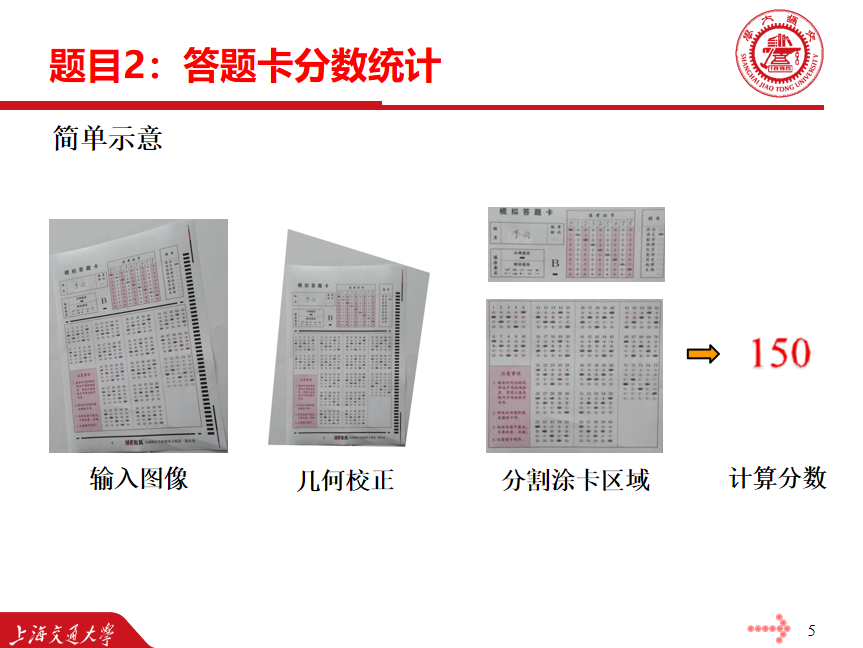

# Answer Sheet Score Statistics (ASSS)



## TL; DR
The goal of this project is to read the answer sheet and calculate the score of the multiple choice question. This project is able to process answer sheets from different angles and find multiple choice areas. And for different answers given, the score of the answer sheet can be calculated.

## Getting Started
1. **Environment**
    ```bash
    conda create -n cv python==3.8.19
    conda activate cv
    pip install -r requirements.txt
    ```
2. **Run**
    ```bash
    python main.py
    ```
   
## File Structure
The structure of project folder is:

```
answer_sheet_score/
├── __pycache__/
├── cut_result/  # answers of each question after cutting the answer sheet
│	├──1.jpg
│	├──2.jpg
│	├──......
│	└──85.jpg
├── failed_try/  # our false attempts
├── images/
│	├─pipeline.png  # our pipeline
│	└─background.ong #UI background
├── output/
│	├──initialed.jpg  # the initialed answer sheet
│	├──inside_1.jpg  # the inside border of the answer sheet
│	├──......
│	└──outside.jpg  # the outside border of the answer sheet
├── source/
│	├──1.jpg  # the first input image (randomly photoed)
│	├──2.jpg  # the second input image (randomly photoed)
│	├──3.jpg  # the third input image (randomly photoed)
│	├──example.jpg  # the standard answer sheet
│	└──warped_image.png  # the result after corrected geometrically
├── main.py
├── README.md
├── requirements.txt
├── settings.py  # some settings, could be changed for different situations
├── utils.py  # the defination of some useful functions
└── GUI.py  # some classes of GUI on the basis of pyQt5, including some functions about summing up scores
```